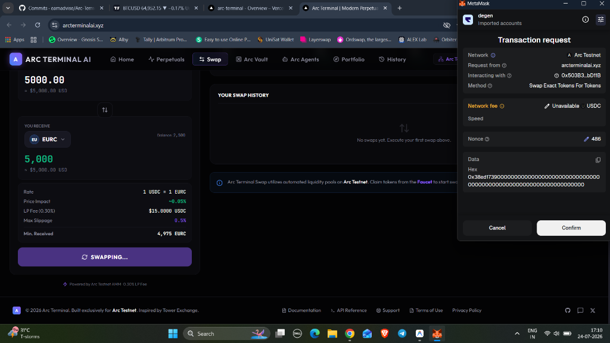
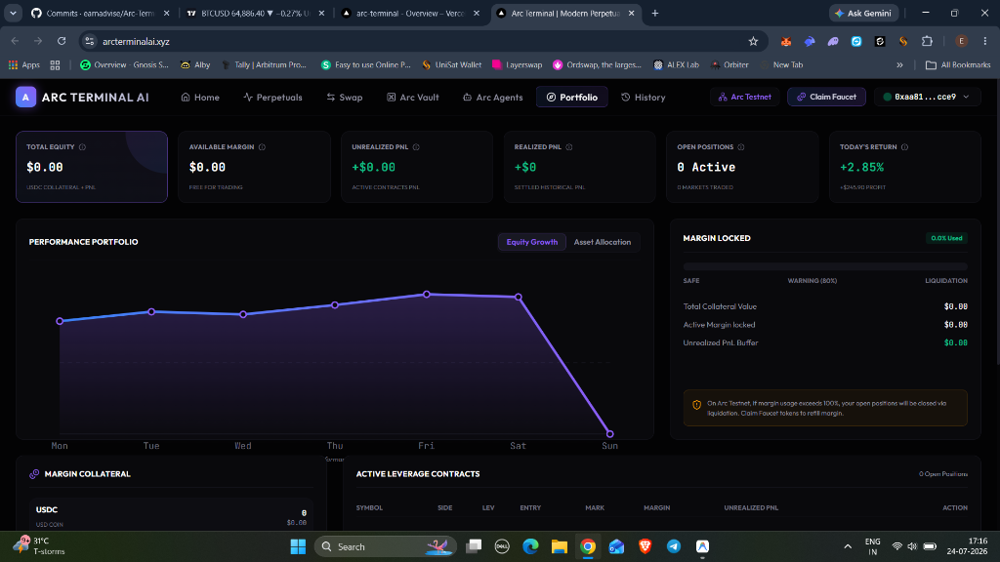
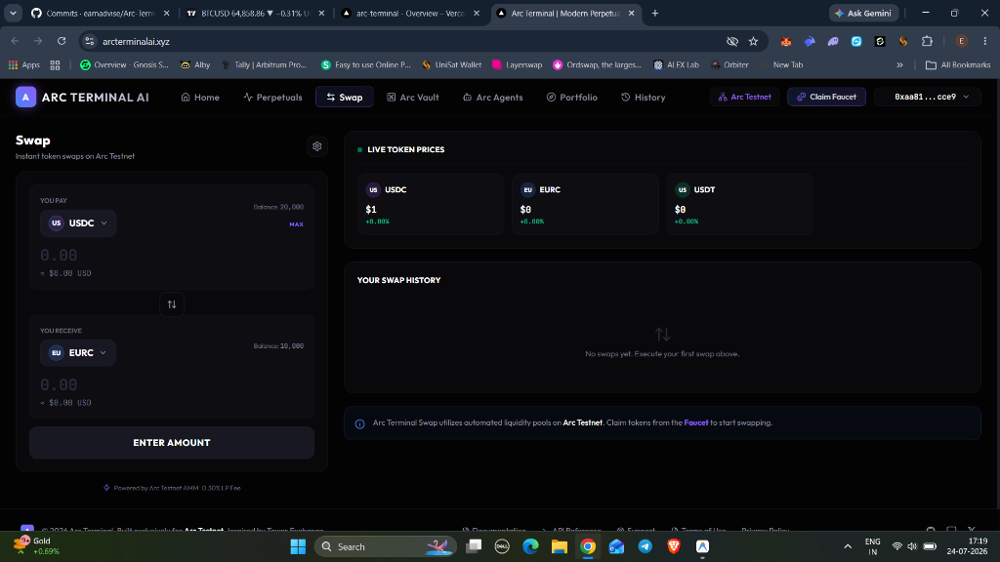

# ⚡ Arc Terminal

> **Next-Generation Agentic Derivatives, Spot AMM & Real-Yield Vault Interface on Arc Network.**

[](https://arcterminalai.xyz)
[](https://x.com/arcterminalai)
[](https://rpc.testnet.arc.network)

---

## 🌟 Project Overview

**Arc Terminal** is a unified decentralized trading terminal designed for active traders and autonomous AI agents. Built natively on **Arc Network**, it combines agentic natural language trade execution via **Arc AI**, zero price-impact perpetual derivatives, and autocompounding ERC-4626 stablecoin **Vault** liquidity pools into a high-performance, non-custodial Web3 interface.

---

## 🔗 Live Demo & Video

- **Live Demo Link:** [https://arcterminalai.xyz](https://arcterminalai.xyz)
- **Demo Video Link:** [Watch Demo Video on YouTube](https://youtu.be/sW4ftxIae-o)

---

## 📸 Screenshots





---

## 🔥 Features

### 🤖 1. Agentic Natural Language Execution (Arc AI)
- **LLM Intent Engine:** Execute complex token swaps, open leveraged positions, and optimize portfolio allocation using natural language chat prompts (e.g. `/swap 10 USDC to EURC`).
- **ABI Payload Encoding:** Automatically constructs optimal routing and contract payloads for one-click wallet signature approval.
- **100% Non-Custodial:** User funds remain fully controlled by the connected Web3 wallet.

### 📈 2. 20x Perpetual Derivatives
- **Zero Price Impact:** Execute leveraged trades up to 20x on BTC, ETH, and SOL index prices.
- **Vault LP Collateralization:** Leveraged positions are backed directly by the platform's multi-asset Vault liquidity pools.
- **Max Position Sizing:** Built-in dynamic MAX button calculating exact position limits accounting for margin, leverage, and fee buffers.

### 🏦 3. Real Yield Vaults (ERC-4626)
- **4.5% - 5.0% APY:** Generates organic, non-inflationary yield from perpetual trading fees, borrowing interest (funding rates), liquidations, and AMM swap fees.
- **Autocompounding Shares:** Tokenized vault shares (`aUSDC`, `aEURC`) automatically accrue value relative to underlying `totalAssets()`.

### 🛡️ 4. Direct RPC Failover Architecture
- **Zero-Latency Reads:** Routes read queries directly to `rpc.testnet.arc.network`, bypassing browser wallet read timeouts.
- **Resilient Polling:** 2-second fast balance polling, staggered post-transaction refreshes, and state synchronization to prevent UI flickering.

---

## 🔵 Circle Products Used

Arc Terminal heavily relies on Circle's stablecoin infrastructure for routing, settlement, and yield generation:
- **USDC:** Used as the primary base currency for swap routing, perpetual margin collateral, and our primary ERC-4626 Yield Vault.
- **EURC:** Supported for FX swaps against USDC and has its own dedicated Yield Vault.

---

## 📜 Smart Contract Addresses (Arc Testnet)

### ⚙️ Core Infrastructure Contracts
| Contract / Protocol | Address | Description |
| :--- | :--- | :--- |
| **Synthra V3 SwapRouter** | `0xA545bCB1Bd7985c59ea162aB1748A0803434C31b` | Concentrated Liquidity AMM Swap Router |
| **Perpetuals Vault** | `0x503B3910ff21948464AA92BaB16a6200848bD11B` | Perpetual Derivatives Core Trading Contract |
| **USDC Vault** | `0xB5dAd4840ef25d6A7Ea8c19E8C6d438197F5AfB9` | ERC-4626 Yield Vault (`aUSDC` Shares, 5.0% APY) |
| **EURC Vault** | `0xC2752C4e2c6FFaf4f8aBA432d98A9d2ae216BD8E` | ERC-4626 Yield Vault (`aEURC` Shares, 4.5% APY) |

### 🪙 Supported Tokens
| Token | Decimals | Address |
| :--- | :---: | :--- |
| **USDC** | 6 | `0x3600000000000000000000000000000000000000` |
| **USDT** | 18 | `0x175CdB1D338945f0D851A741ccF787D343E57952` |
| **EURC** | 6 | `0x89B50855Aa3bE2F677cD6303Cec089B5F319D72a` |
| **cirBTC** | 8 | `0xf0C4a4CE82A5746AbAAd9425360Ab04fbBA432BF` |

---

## 🚀 Installation Instructions

### 1. Clone the Repository
```bash
git clone https://github.com/earnadvise/Arc-Terminal.git
cd Arc-Terminal
```

### 2. Install Dependencies
```bash
npm install
```

### 3. Run Development Server
```bash
npm run dev
```
Open [http://localhost:3000](http://localhost:3000) in your browser.

### 4. Build for Production
```bash
npm run build
```
