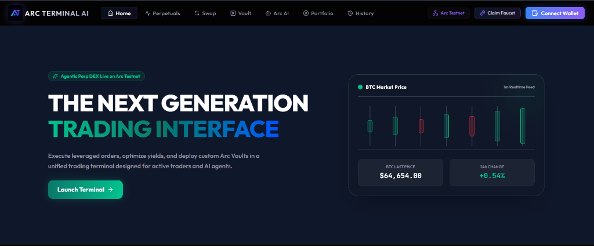
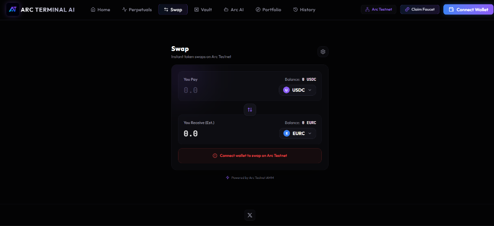
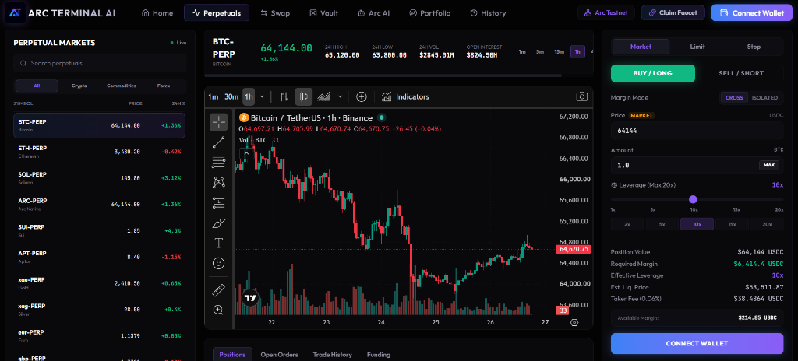

# ⚡ Arc Terminal

> **Next-Generation Agentic Derivatives, Spot AMM & Real-Yield Vault Interface on Arc Mainnet.**

[](https://arcterminalai.xyz)
[](https://x.com/arcterminalai)
[](https://arc.io)

---

## 🌟 Project Overview

**Arc Terminal** is a unified decentralized trading terminal designed for active traders and autonomous AI agents. Built natively on **Arc Mainnet**, it combines agentic natural language trade execution via **Arc AI**, zero price-impact perpetual derivatives, fiat-to-crypto onramping via the **Arc Onramp Kit**, and autocompounding ERC-4626 stablecoin **Vault** liquidity pools into a high-performance, non-custodial Web3 interface.

---

## 🔗 Live Demo & Video

- **Live Demo Link:** [https://arcterminalai.xyz](https://arcterminalai.xyz)
- **Demo Video Link:** [Watch Demo Video on YouTube](https://youtu.be/obzSXVyPAaM)

---

## 📸 Screenshots





---

## 🔥 Features

### 🤖 1. Agentic Natural Language Execution (Arc AI)
- **LLM Intent Engine:** Execute complex token swaps, open leveraged positions, and optimize portfolio allocation using natural language chat prompts (e.g. `/swap 10 USDC to EURC`).
- **ABI Payload Encoding:** Automatically constructs optimal routing and contract payloads for one-click wallet signature approval.
- **100% Non-Custodial:** User funds remain fully controlled by the connected Web3 wallet.

### 📈 2. 20x Perpetual Derivatives
- **Zero Price Impact:** Execute leveraged trades up to 20x on BTC, ETH, and SOL index prices.
- **Vault LP Collateralization:** Leveraged positions are backed directly by the platform's multi-asset Vault liquidity pools.
- **Max Position Sizing:** Built-in dynamic MAX button calculating exact position limits accounting for margin, leverage, and fee buffers.

### 🏦 3. Real Yield Vaults (ERC-4626)
- **4.5% - 5.0% APY:** Generates organic, non-inflationary yield from perpetual trading fees, borrowing interest (funding rates), liquidations, and AMM swap fees.
- **Autocompounding Shares:** Tokenized vault shares (`aUSDC`, `aEURC`) automatically accrue value relative to underlying `totalAssets()`.

### 💳 4. Fiat-to-Crypto Onramp (Arc Onramp Kit)
- **Buy USDC with Fiat:** Users can purchase USDC directly within the terminal using Apple Pay, Google Pay, debit cards, and bank transfers (SEPA).
- **Built-in Identity Verification:** KYC flow is handled entirely within the embedded widget — no external redirects.
- **Transparent Pricing:** Clear transaction costs displayed before purchase confirmation.
- **Pre-built Widget:** Powered by `@circle-fin/onramp-kit` with a secure server-side session minting flow via Next.js API routes.

### 🌉 5. Cross-Chain Bridge (Circle CCTP)
- **Seamless USDC Bridging:** Transfer USDC between Arc Mainnet and other supported EVM chains using Circle's Cross-Chain Transfer Protocol.
- **Real-Time UI Tracking:** Live status updates for cross-chain transfers directly within the terminal.

### 🛡️ 6. Direct RPC Failover Architecture
- **Zero-Latency Reads:** Routes read queries directly to the Arc Mainnet RPC, bypassing browser wallet read timeouts.
- **Resilient Polling:** 2-second fast balance polling, staggered post-transaction refreshes, and state synchronization to prevent UI flickering.

---

## 🔄 Recent Updates (Latest)

- **Arc Mainnet Migration:** Fully migrated the entire platform from Arc Testnet to Arc Mainnet — all contracts, RPC endpoints, and configurations now operate on the live production network.
- **Fiat Onramp Integration:** Added "Buy USDC" button powered by Arc Onramp Kit (`@circle-fin/onramp-kit`) enabling fiat-to-USDC purchases via Apple Pay, Google Pay, debit cards, and bank transfers directly inside the terminal.
- **AppKit Cross-Chain Bridge:** Implemented a seamless cross-chain USDC bridge using Circle's AppKit and CCTP, enabling transfers between Arc Mainnet and supported EVM chains with real-time UI tracking.
- **Premium Light Mode Overhaul:** Fully migrated the decentralized application to a stunning, modern light theme featuring vivid sky blue gradients, frosted glassmorphism panels, and crisp charcoal text for enhanced professional aesthetics.
- **Client-Side Oracle Synchronization:** Resolved Vercel geo-blocking issues by migrating price fetching directly to the client side, ensuring 100% accurate real-time index prices for Perpetuals.
- **UI Legibility Enhancements:** Improved contrast and text visibility across the Arc AI Terminal and Yield Vaults to guarantee readability.
- **Contract Architecture Preserved:** All Arc Mainnet smart contracts remain unchanged and fully functional without disruption.

---

## 🔵 Circle Products Used

Arc Terminal heavily relies on Circle's stablecoin infrastructure for routing, settlement, yield generation, and fiat onramping:

- **Arc Onramp Kit (`@circle-fin/onramp-kit`):** Enables fiat-to-USDC purchases directly inside the terminal via Apple Pay, Google Pay, debit cards, and bank transfers. Session tokens are minted server-side using a secure Next.js API route.
- **Circle AppKit & CCTP:** Powers the native cross-chain bridging infrastructure between Arc Mainnet and supported EVM chains.
- **USDC:** Used as the primary base currency for swap routing, perpetual margin collateral, fiat onramp destination token, and our primary ERC-4626 Yield Vault.
- **EURC:** Supported for FX swaps against USDC and has its own dedicated Yield Vault.

---

## 📜 Smart Contracts (Arc Mainnet)

- **ArcPerpRouter:** [`0x68E6EF57B846CA3dBb3Aed6E8e7512BB2180C8C7`](https://explorer.arc.io/address/0x68E6EF57B846CA3dBb3Aed6E8e7512BB2180C8C7)
- **ArcSafePay:** [`0xCA51920257DD503150F3eF9a3fE4a34B2176C866`](https://explorer.arc.io/address/0xCA51920257DD503150F3eF9a3fE4a34B2176C866)

---

## 🚀 Installation Instructions

### 1. Clone the Repository
```bash
git clone https://github.com/earnadvise/Arc-Terminal.git
cd Arc-Terminal
```

### 2. Install Dependencies
```bash
npm install
```

### 3. Set Environment Variables
```bash
cp .env.example .env.local
```
Add the following to your `.env.local`:
```env
# Arc Onramp Kit — secret API key (server-side only, never expose to client)
ARC_API_KEY=YOUR_CIRCLE_API_KEY

# Arc Onramp Kit — public App ID (safe for client-side)
NEXT_PUBLIC_ONRAMP_APP_ID=YOUR_ONRAMP_APP_ID
```

### 4. Run Development Server
```bash
npm run dev
```
Open [http://localhost:3000](http://localhost:3000) in your browser.

### 5. Build for Production
```bash
npm run build
```

---

## 🏗️ Architecture & Smart Contracts

Arc Terminal functions as a **Smart Routing DEX Aggregator**.

### Smart Contract Integrations
- **ArcRouter (Custom Deployment):** [`0x2de601bE529C4D59DC2b11725a2c75e06aC4cDBa`](https://arcscan.app/address/0x2de601bE529C4D59DC2b11725a2c75e06aC4cDBa)
  - All token swaps on Arc Terminal are routed through our own custom deployed smart contract which acts as a pass-through proxy to capture a 0.1% protocol fee for the treasury.
- **Synthra V3 SwapRouter:** Underlying AMM liquidity pools used to solve the "cold-start" liquidity problem.

### Onramp Architecture
- **Server Route (`/api/onramp`):** Securely mints short-lived session tokens using the Circle API key. Never exposes the secret key to the browser.
- **Client Widget (`@circle-fin/onramp-kit`):** Mounts an iframe-based onramp widget inside the terminal. Handles payment flows, identity verification, and deposit settlement events.
